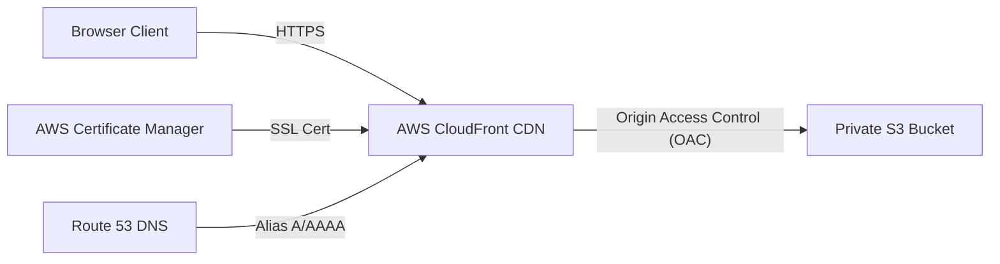

# Complete AWS S3, CloudFront & CDK Deployment Guide

This guide walks you through building your portfolio application and hosting it securely under your custom domain **`aditya.weinventify.com`** using **AWS CDK v2**, **AWS S3 (Private Origin)**, and **AWS CloudFront (CDN with Origin Access Control)** with **SSL/HTTPS**.

---

## 🏗️ Architecture Overview



Key Architectural Principles:
- **Private S3 Origin**: Direct public access is blocked via `BlockPublicAccess.BLOCK_ALL` and SSL is strictly enforced.
- **Origin Access Control (OAC)**: CloudFront authenticates with S3 using AWS SigV4 via OAC (replacing legacy OAI).
- **SPA Error Routing**: Client-side routing requests (403 and 404) are rewritten to `/index.html` with HTTP 200 so deep links work seamlessly on page refresh.

---

## 📁 Repository Structure

```
Portfolio/
├── frontend/             # Angular 22 Single Page Application
│   ├── src/              # Application source code
│   └── package.json      # Frontend build and test scripts
├── iac/                  # AWS CDK v2 Infrastructure Package
│   ├── bin/              # CDK App entry point
│   ├── lib/              # PortfolioStack construct definition
│   └── package.json      # CDK dependencies & scripts
├── .github/workflows/    # GitHub Actions CI/CD workflows
└── README.md
```

---

## Part 1: Build the Frontend Application (`frontend/`)

Before deploying infrastructure or triggering CI/CD, compile the Angular application:

```bash
cd frontend
npm install
npm run build
```

Compiled production assets will be output to:
`frontend/dist/portfolio-app/browser/`

> [!IMPORTANT]
> The CDK stack automatically detects the `frontend/dist/portfolio-app/browser/` folder and deploys it via `BucketDeployment`. Compiling the frontend first ensures your assets are synced and your CloudFront distribution is immediately functional.

---

## Part 2: Deploy Infrastructure with AWS CDK (`iac/`)

The recommended method to provision and manage AWS resources is through the AWS CDK package in `iac/`:

### 1. Install CDK Dependencies
```bash
cd iac
npm install
```

### 2. Synthesize CloudFormation Template
```bash
npm run build
npm run synth
```

### 3. Deploy Stack to AWS
```bash
# Standard deployment (provisions S3 bucket + CloudFront distribution and syncs assets)
npm run deploy

# Custom domain deployment with Route 53 and ACM certificate
npx cdk deploy -c domainName="aditya.weinventify.com" \
               -c certificateArn="arn:aws:acm:us-east-1:123456789012:certificate/..." \
               -c hostedZoneId="Z1234567890ABC"
```

Once deployment completes, the CDK outputs the:
- `BucketName`: The private S3 origin bucket name.
- `DistributionId`: The CloudFront distribution ID.
- `DistributionDomainName`: The CloudFront distribution URL (e.g. `d123456abcdef8.cloudfront.net`).
- `SiteUrl`: The live website URL.

Compiled production assets will be output to:
`frontend/dist/portfolio-app/browser/`

> [!IMPORTANT]
> Upload only the contents of the `browser/` directory (`index.html`, `main-*.js`, `styles-*.css`, `favicon.png`).

---

## Part 3: Automated CLI Deployment

If you have the AWS CLI configured locally (`aws configure`), you can build the frontend and deploy infrastructure in a single step using the root deployment script:

```bash
./deploy-aws.sh
```

---

## Part 4: Automated CI/CD Pipeline with GitHub Actions (OIDC)

Deployments are automated through **GitHub Actions** using **AWS OpenID Connect (OIDC)** authentication (zero long-lived credentials stored in GitHub).

### Step 1: Provision OIDC Provider & Role via AWS CDK (Recommended)

You can provision the entire GitHub OIDC Identity Provider and the IAM Deployment Role in a single command using `PortfolioOidcStack`:

```bash
cd iac
npx cdk deploy PortfolioOidcStack

# If the GitHub OIDC provider already exists in your account:
npx cdk deploy PortfolioOidcStack -c existingOidcProvider=true
```

This will output the `RoleArn` (e.g. `arn:aws:iam::ACCOUNT_ID:role/GitHubActionsPortfolioDeployRole`), which you copy directly to your GitHub repository secrets.

---

### Step 2: (Alternative) Manual AWS Console Setup

If you prefer setting up OIDC manually in the AWS Console:

1. **Create Identity Provider**:
   - Open **AWS IAM Console** -> **Identity Providers** -> **Add provider**.
   - Provider URL: `https://token.actions.githubusercontent.com`. Audience: `sts.amazonaws.com`.
2. **Create IAM Role**:
   - Create a role with the following trust policy (replace `ACCOUNT_ID`):

   ```json
   {
     "Version": "2012-10-17",
     "Statement": [
       {
         "Effect": "Allow",
         "Principal": {
           "Federated": "arn:aws:iam::ACCOUNT_ID:oidc-provider/token.actions.githubusercontent.com"
         },
         "Action": "sts:AssumeRoleWithWebIdentity",
         "Condition": {
           "StringEquals": {
             "token.actions.githubusercontent.com:aud": "sts.amazonaws.com"
           },
           "StringLike": {
             "token.actions.githubusercontent.com:sub": "repo:Kumar2106/Portfolio:*"
           }
         }
       }
     ]
   }
   ```

### Step 3: Attach IAM Permissions Policy

Attach a least-privilege policy allowing S3 synchronization and CloudFront cache invalidation:

```json
{
  "Version": "2012-10-17",
  "Statement": [
    {
      "Effect": "Allow",
      "Action": [
        "s3:PutObject",
        "s3:GetObject",
        "s3:ListBucket",
        "s3:DeleteObject"
      ],
      "Resource": [
        "arn:aws:s3:::YOUR_S3_BUCKET_NAME",
        "arn:aws:s3:::YOUR_S3_BUCKET_NAME/*"
      ]
    },
    {
      "Effect": "Allow",
      "Action": [
        "cloudfront:CreateInvalidation",
        "cloudfront:GetInvalidation"
      ],
      "Resource": "arn:aws:cloudfront::ACCOUNT_ID:distribution/YOUR_CLOUDFRONT_DISTRIBUTION_ID"
    }
  ]
}
```

### Step 4: Configure GitHub Secrets

Add these repository secrets in GitHub (`Settings` -> `Secrets and variables` -> `Actions`):
- `AWS_ROLE_ARN`: IAM Role ARN (e.g. `arn:aws:iam::ACCOUNT_ID:role/GitHubActionsPortfolioDeployRole`)
- `AWS_REGION`: AWS Region (e.g. `us-east-1`)

Optional (for custom domain deployment):
- `DOMAIN_NAME`: `aditya.weinventify.com`
- `CERTIFICATE_ARN`: `arn:aws:acm:us-east-1:...:certificate/...`
- `HOSTED_ZONE_ID`: `Z...`

### Step 5: Automatic Deployment via AWS CDK

Every time code is pushed or merged to `main` (or triggered manually via `workflow_dispatch`), `.github/workflows/deploy.yml` automatically:
1. Installs dependencies and compiles the Angular production bundle in `frontend/`.
2. Installs CDK dependencies and builds TypeScript in `iac/`.
3. Authenticates keylessly to AWS using OIDC.
4. Executes `npx cdk deploy --require-approval never`, which manages the S3 bucket, CloudFront distribution with OAC, synchronizes the frontend assets, and invalidates the CloudFront cache globally.
