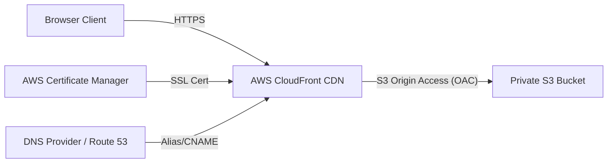

# Complete AWS S3 & CloudFront Deployment Guide

This guide walks you through the step-by-step process of building your portfolio application and hosting it securely under your custom domain **`aditya.weinventify.com`** using **AWS S3** and **AWS CloudFront (CDN)** with **SSL/HTTPS**.

---

## Architecture Overview


---

## Part 1: Build the Application
Before uploading anything to AWS, compile the Angular application for production.

1. Open your terminal in the project directory (`portfolio-app`).
2. Run the following command:
   ```bash
   npm run build
   ```
3. Once completed, your static files will be generated in:
   `portfolio-app/dist/portfolio-app/browser`
   
   > [!IMPORTANT]
   > Do **not** upload the entire project directory. Only upload the files inside the `browser` folder (`index.html`, `main-*.js`, `styles-*.css`, `favicon.ico`).

---

## Part 2: Choose Your Hosting Option

You can host your portfolio in two ways:
* **Option A: S3 Direct Static Website Hosting (Quickest, HTTP only)**
* **Option B: S3 + CloudFront CDN + ACM Certificate (Recommended, HTTPS, Secure, Custom Domain)**

---

### Option A: S3 Direct Static Website Hosting (HTTP Only)

#### 1. Create S3 Bucket
1. Open the **[AWS Management Console](https://aws.amazon.com/console/)** and go to **S3**.
2. Click **Create bucket**.
3. Configure settings:
   - **Bucket name**: Enter a unique name (e.g., `kumar-aditya-portfolio`).
   - **AWS Region**: Select your preferred region (e.g., `us-east-1`).
4. **Block Public Access settings**:
   - **UNCHECK** the box **Block all public access**.
   - Check the acknowledgement box: *"I acknowledge that the current settings might result in this bucket and the objects within becoming public."*
5. Click **Create bucket**.

#### 2. Upload Static Files
1. Click on your newly created bucket name.
2. Click **Upload** -> Drag and drop all the contents of the `portfolio-app/dist/portfolio-app/browser/` folder.
3. Click **Upload** at the bottom.

#### 3. Configure Bucket Policy
1. Go to the **Permissions** tab of your bucket -> scroll to **Bucket policy** -> click **Edit**.
2. Paste the following policy JSON (replace `YOUR_BUCKET_NAME` with your actual bucket name):
   ```json
   {
       "Version": "2012-10-17",
       "Statement": [
           {
               "Sid": "PublicReadGetObject",
               "Effect": "Allow",
               "Principal": "*",
               "Action": "s3:GetObject",
               "Resource": "arn:aws:s3:::YOUR_BUCKET_NAME/*"
           }
       ]
   }
   ```
3. Click **Save changes**.

#### 4. Enable Static Hosting
1. Go to the **Properties** tab of your bucket -> scroll to the bottom to **Static website hosting** -> click **Edit**.
2. Select **Enable** and configure:
   - **Index document**: Enter `index.html`.
   - **Error document**: Enter `index.html` (required to support Angular single-page routing on refreshes).
3. Click **Save changes**.
4. Access the site via the generated **Bucket website endpoint** URL.

---

### Option B: S3 + CloudFront CDN (HTTPS + Custom Domain `aditya.weinventify.com`)

To host using your custom domain securely with SSL, follow these steps.

#### 1. Create S3 Bucket (Private)
1. Go to **S3** -> click **Create bucket** -> enter bucket name (e.g., `kumar-aditya-portfolio`).
2. Leave **Block all public access** **CHECKED** (we keep the bucket private; only CloudFront will be allowed to read from it).
3. Click **Create bucket** and upload your files (from `portfolio-app/dist/portfolio-app/browser/`) directly into it.

#### 2. Request SSL Certificate in ACM
> [!IMPORTANT]
> **Region Lock**: CloudFront requires SSL certificates to be created in the **`us-east-1` (N. Virginia)** region. Switch your AWS Console region to `us-east-1` before requesting the certificate.

1. Go to **AWS Certificate Manager (ACM)** in `us-east-1`.
2. Click **Request certificate** -> choose **Request a public certificate** -> click **Next**.
3. Domain name: `aditya.weinventify.com`.
4. Validation method: **DNS validation**.
5. Click **Request**.
6. Create the CNAME validation record in your DNS provider's dashboard using the generated CNAME Name and CNAME Value. Once validated, status turns to **Issued**.

#### 3. Create CloudFront Distribution
1. Search for **CloudFront** -> click **Create distribution**.
2. **Origin Settings**:
   - **Origin domain**: Select your S3 bucket.
   - **Origin access**: Select **Origin access control settings (recommended)**.
   - Click **Create control setting** -> click **Create** (creates OAC configs to authenticate CloudFront).
3. **Default Cache Behavior**:
   - **Viewer protocol policy**: Select **Redirect HTTP to HTTPS**.
   - **Allowed HTTP methods**: Select `GET, HEAD`.
4. **Settings**:
   - **Alternate domain name (CNAME)**: Click **Add item** and enter: `aditya.weinventify.com`.
   - **Custom SSL certificate**: Select your ACM certificate for `aditya.weinventify.com`.
   - **Default root object**: Enter `index.html`.
5. Click **Create distribution**.

#### 4. Sync S3 Bucket Policy
1. Once created, select your distribution -> go to **Origins** -> select the S3 origin -> click **Edit**.
2. Click the **Copy policy** button under S3 bucket access.
3. Navigate back to your **S3 Bucket** -> **Permissions** tab -> **Bucket policy** -> click **Edit**.
4. Paste the copied policy (allows CloudFront read access to the private bucket) and save changes.

#### 5. Configure CloudFront Error Pages (Angular Routing Fix)
Because Angular is a single-page application (SPA), refreshing sub-paths will return `403 Forbidden` from S3. We must configure CloudFront to handle this:
1. In the CloudFront console, select your distribution -> click the **Error pages** tab.
2. Click **Create custom error response**.
3. Set:
   - **HTTP error code**: **403: Forbidden** (and repeat for **404: Not Found**).
   - **Customize error response**: Select **Yes**.
   - **Response page path**: `/index.html`.
   - **HTTP response code**: **200: OK**.
4. Click **Create**.

#### 6. Configure DNS (Point Domain to CloudFront)

##### Option A: If using AWS Route 53
1. Go to **Route 53** -> **Hosted Zones** -> select `weinventify.com`.
2. Click **Create record**.
3. Set Record name: `aditya`.
4. Select Record type: **A - Alias**.
5. Toggle the **Alias** switch to **ON**.
6. Under **Route traffic to**, choose **Alias to CloudFront distribution** and select your distribution URL (e.g., `d12345.cloudfront.net`).
7. Click **Create records**.

##### Option B: If using another DNS provider
1. Go to your DNS provider (GoDaddy, Namecheap, Cloudflare, etc.).
2. Add a new **CNAME record**:
   - **Host/Name**: `aditya`
   - **Target/Value**: Copy your CloudFront distribution domain (e.g., `d12345.cloudfront.net`).
3. Save the record and wait for propagation (usually 5–10 minutes).

---

## Part 3: Automated CLI Deployment
If you have AWS CLI configured locally (`aws configure`), you can automate the Option A deployment by using the helper script located in the project root:

```bash
./deploy-aws.sh <your-s3-bucket-name>
```
This script will build the bundle, create the bucket, disable blocks, apply bucket policies, configure hosting parameters, and upload files.
