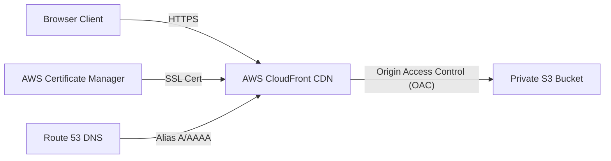

# Complete AWS S3, CloudFront & CDK Deployment Guide

This guide walks you through building your portfolio application and hosting it securely under your custom domain **`aditya.weinventify.com`** using **AWS CDK v2**, **AWS S3 (Private Origin)**, and **AWS CloudFront (CDN with Origin Access Control)** with **SSL/HTTPS**.

---

## 🏗️ Architecture Overview


```mermaid
graph LR
    User[Browser Client] -- HTTPS --> CF[AWS CloudFront CDN]
    CF -- Origin Access Control (OAC) --> S3[Private S3 Bucket]
    ACM[AWS Certificate Manager] -- SSL Cert --> CF
    DNS[Route 53 DNS] -- Alias A/AAAA --> CF
```

Key Architectural Principles:
- **Private S3 Origin**: Direct public access is blocked via `BlockPublicAccess.BLOCK_ALL` and SSL is strictly enforced.
- **Origin Access Control (OAC)**: CloudFront authenticates with S3 using AWS SigV4 via OAC (replacing legacy OAI).
- **SPA Error Routing**: Client-side routing requests (403 and 404) are rewritten to `/index.html` with HTTP 200 so deep links work seamlessly on page refresh.

---

## 📁 Repository Structure

```
Portfolio/
├── frontend/             # Angular 22 Single Page Application
│   ├── src/              # Application source code
│   └── package.json      # Frontend build and test scripts
├── iac/                  # AWS CDK v2 Infrastructure Package
│   ├── bin/              # CDK App entry point
│   ├── lib/              # PortfolioStack construct definition
│   └── package.json      # CDK dependencies & scripts
├── .github/workflows/    # GitHub Actions CI/CD workflows
└── README.md
```

---

## Part 1: Build the Frontend Application (`frontend/`)

Before deploying infrastructure or triggering CI/CD, compile the Angular application:

```bash
cd frontend
npm install
npm run build
```

Compiled production assets will be output to:
`frontend/dist/portfolio-app/browser/`

> [!IMPORTANT]
> The CDK stack automatically detects the `frontend/dist/portfolio-app/browser/` folder and deploys it via `BucketDeployment`. Compiling the frontend first ensures your assets are synced and your CloudFront distribution is immediately functional.

---

## Part 2: Deploy Infrastructure with AWS CDK (`iac/`)

The recommended method to provision and manage AWS resources is through the AWS CDK package in `iac/`:

### 1. Install CDK Dependencies
```bash
cd iac
npm install
```

### 2. Synthesize CloudFormation Template
```bash
npm run build
npm run synth
```

### 3. Deploy Stack to AWS
```bash
# Standard deployment (provisions S3 bucket + CloudFront distribution and syncs assets)
npm run deploy

# Custom domain deployment with Route 53 and ACM certificate
npx cdk deploy -c domainName="aditya.weinventify.com" \
               -c certificateArn="arn:aws:acm:us-east-1:123456789012:certificate/..." \
               -c hostedZoneId="Z1234567890ABC"
```

Once deployment completes, the CDK outputs the:
- `BucketName`: The private S3 origin bucket name.
- `DistributionId`: The CloudFront distribution ID.
- `DistributionDomainName`: The CloudFront distribution URL (e.g. `d123456abcdef8.cloudfront.net`).
- `SiteUrl`: The live website URL.

> [!NOTE]
> To deploy into an already-running bucket and distribution instead of creating new ones, pass `-c distributionId=...`, `-c bucketName=...` and `-c distributionDomainName=...` together (or set `DISTRIBUTION_ID`, `BUCKET_NAME` and `DISTRIBUTION_DOMAIN_NAME`). The stack then imports those resources and uploads assets without pruning existing objects.

> [!WARNING]
> Imported resources are not reconfigured by CDK, so they do not inherit the secure defaults applied to newly created ones. Before using reuse mode, confirm the existing bucket has all four S3 Block Public Access settings enabled and a bucket policy that denies non-TLS requests (`aws:SecureTransport`), and that the existing distribution uses Origin Access Control, redirects HTTP to HTTPS, and enforces TLS 1.2 or newer (`TLSv1.2_2021`).

---

## Part 3: Automated CLI Deployment

If you have the AWS CLI configured locally (`aws configure`), you can build the frontend and deploy infrastructure in a single step using the root deployment script:

```bash
./deploy-aws.sh
```

---

## Part 4: Automated CI/CD Pipeline with GitHub Actions (OIDC)

Deployments are automated through **GitHub Actions** using **AWS OpenID Connect (OIDC)** authentication (zero long-lived credentials stored in GitHub). Frontend and backend deploy with **separate, least-privilege IAM roles**.

### Step 1: Provision the OIDC Provider & Deploy Roles via AWS CDK

`PortfolioOidcStack` creates the GitHub OIDC identity provider and two roles that only workflows running on `main` of this repository can assume:

| Role | Used by | Scope |
| --- | --- | --- |
| `GitHubActionsPortfolioFrontendDeployRole` | `deploy.yml` | CDK bootstrap roles, `Portfolio*` CloudFormation stacks, portfolio S3 bucket, CloudFront invalidation |
| `GitHubActionsPortfolioBackendDeployRole` | `deploy-backend.yml` | `portfolio-*` SAM/CloudFormation stacks, SAM packaging bucket, Lambda, API Gateway, Lambda execution roles |

```bash
cd iac
npx cdk deploy PortfolioOidcStack

# If the GitHub OIDC provider already exists in your account:
npx cdk deploy PortfolioOidcStack -c existingOidcProvider=true
```

The exact IAM policies live in [`iac/lib/portfolio-oidc-stack.ts`](iac/lib/portfolio-oidc-stack.ts), which is the single source of truth.

### Step 2: Configure GitHub Secrets & Variables

Add these in GitHub (`Settings` -> `Secrets and variables` -> `Actions`).

**Secrets**
- `AWS_FRONTEND_ROLE_ARN`: the `FrontendRoleArn` stack output
- `AWS_BACKEND_ROLE_ARN`: the `BackendRoleArn` stack output
- `AWS_REGION` (optional): defaults to `ap-south-1`
- `CERTIFICATE_ARN`, `HOSTED_ZONE_ID` (optional): custom domain with a newly created distribution
- `CONTACT_RECIPIENT_EMAIL`, `CONTACT_SENDER_EMAIL` (optional): contact API email addresses

**Variables** (optional; override the `cdk.json` context defaults)
- `DOMAIN_NAME`: custom domain, e.g. `aditya.weinventify.com`
- `DISTRIBUTION_ID`, `BUCKET_NAME`, `DISTRIBUTION_DOMAIN_NAME`: existing hosting resources to deploy into (all three must be set together)

### Step 3: Automatic Deployment

On pull requests to `main` that touch `frontend/**`, `iac/**` or the workflow file, `.github/workflows/deploy.yml` runs the frontend tests, builds the bundle, and synthesizes the CDK app. On push to `main` (or `workflow_dispatch`) it then:
1. Downloads the built frontend artifact.
2. Authenticates to AWS with the frontend OIDC role.
3. Runs `npx cdk deploy PortfolioStack --require-approval never`, which uploads the assets to S3 and invalidates the CloudFront cache.

The backend follows the same pattern in `.github/workflows/deploy-backend.yml` — see the [Backend Documentation](backend/README.md).
